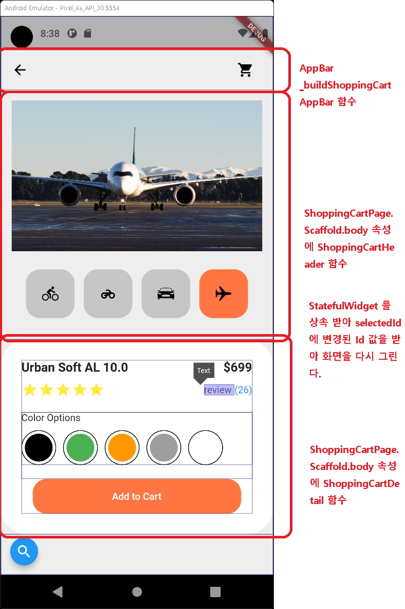
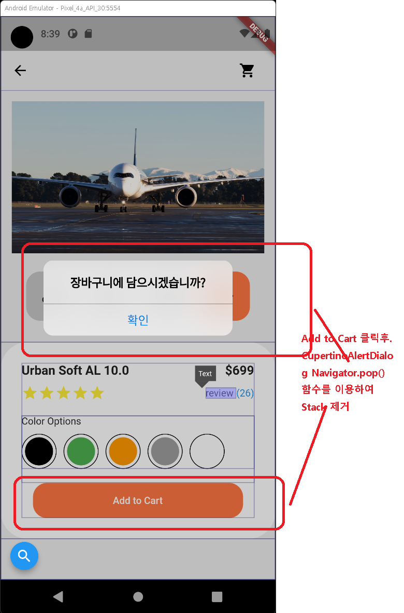

# 챕터 08 쇼핑카드 앱 만들기
 

## 08 _ 1 앱 구조보기   
 

## 08 _ 2 앱 플러터 상태 관리 StatefulWidget 

    1.StatefulWidget이란?
        변수의 값(상태값)에 따라 화면을 다시 그릴 수도 있는 위젯.
        StatelessWidget 는 Widget
        StatefulWidget 는 Widget + State 
        예)사진 액자에 사진 여러장이 돌아 가면서 나오는 것을 생각 하면 됨.
        사진 + 액자 에서 사진 부분만 StatefulWidget 를 사용 하면 되겠죠!
        StatefulWidget 는 setState 함수를 통해서 상태변수를 변경 하게 되면
        build 함수가 다시 실행 되면서 그림이 다시 그려지게 됩니다.

## 08 _ 3 앱 빼대 작성하기

    1.프로젝트 구조 셋팅하기
        -lib/components 패키지 생성, 그안에 필요한 소스를 분할 하여 넣음.
        여러명이서 개발시 필요 또는 공통 기능이 구현해 다른 프로그램 개발시 사용이 필요한 소스는 분할 하는게 좋음.
    2.이미지 파일등 필요한 것 assets/ 에 넣는다.

## 08 _ 4 앱 만들어보기
 

    1.AppBar _buildShoppingCartAppBar()
    2.헤더 만들기 ShoppingCartHeader - setState() 함수
    3.디테일 만들기 ShoppingCartDetail - Stack 위젯과 Positioned 위젯
        -Stack 위젯은 여러 위젯을 겹치려는 경우에 사용, Postioned 위젯은 Stack 위젯과 함께 사용됨.
    4.디테일 만들기 ShoppingCartDetail - CupertinoAlertDialog 위젯

        |----------------------|
        |                      | Add to Cart 클릭후.
        | CupertinoAlertDialog-|---> Pop() Navigator.pop() 함수를 이용하여 Stack 제거
        |                      |-> Stack
        |----------------------|
        | ShoppingCartpage     |-> 처음 화면. Add to Cart 클릭전. 
        |----------------------|

 

  
### Mixin 이해해보기  
 

- 믹스인은 프로그래머가 특정 코드를 다른 클래스에 삽입 할 수 있도록 하는 프로그래밍 개념입니다. 믹스인 프로그래밍은 특정 클래스에 작성된 기능들을 다른 클래스와 혼합하는 소프트웨어 개발 유형입니다.[5]

믹스인 클래스는 필요로 하는 기능들을 포함하는 상위 클래스로서 역할을 합니다. 그리고 하위 클래스는 이 기능을 상속하거나 단순히 재사용 할 수 있습니다. 하지만 자식클래스를 특수화(Specialization)하는 수단으로는 사용할 수 없습니다. 일반적으로 믹스인은 엄격한 단일 "is-a"관계(상속관계)를 만들지 않고 원하는 기능을 하위 클래스로 전달합니다. 여기에 믹스인과 상속의 중요한 차이점이 있습니다. 자식클래스는 여전히 부모클래스의 모든 기능을 상속 할 수 있지만, 부모와 자식이라는 의미는 반드시 부여될 필요는 없습니다.

[위키백과 ko.wikipedia.org/wiki/믹스인](https://ko.wikipedia.org/wiki/%EB%AF%B9%EC%8A%A4%EC%9D%B8)

 

For help getting started with Flutter, view our
[online documentation](https://flutter.dev/docs), which offers tutorials,
samples, guidance on mobile development, and a full API reference.
